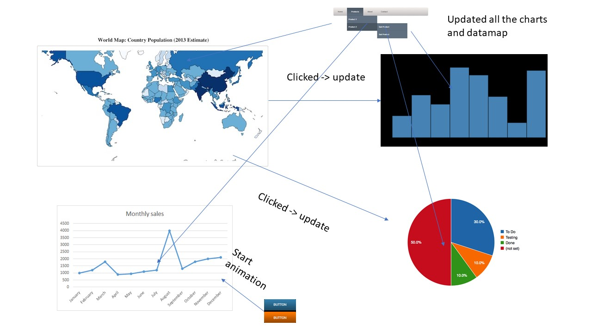

# Project Minor Programming (UvA)
* Name: Julien Fer
* Student Number: 10649441
* University: University of Amsterdam

## Problem Statement
A hot topic in sport news is the development of the transfer values in
football. The last past years the values rised to high amounts and from clubs as
well associety complaints arises regarding this development. This project
tries toexplain this development based on the top 250 transfers from
2000-2018. Certainindicators will be examined as the competitions these
transfers took place, which club bought and the positions of the players.
Hopefully the statistics will show a pattern trough the years.

## Solution
A D3 dashboard that shows the development of the total transfer fees over
time which can be examined in more depth with some indicators as the
country, season and position.

Main features:

* Interactive world map (MVP)
  - Shows all countries with hover and click.

* Interactive horizontal bar chart (MVP)
  - Shows the total transfer fees per country/club with hover and click.

* Sunburst (MVP)
  - Shows the distribtuion of the total transfer fee with tooltip and click

* Navbar with dropdowns (MVP)
  - Navbar to switch to home page, visualization, explanation (modal) and Github

Extra features:

* line chart with animation
  - shows the development of the total transfer fee over time
* Homepage with image and footer
* An explanation part about the dashboard
  - can be either a modal or another html template

See the following visual sketch

## Visual sketch

