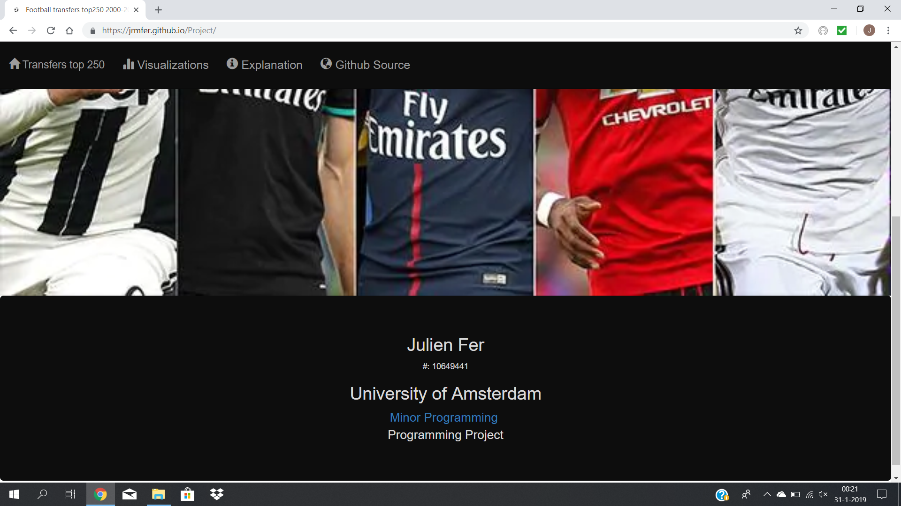

# Project Minor Programming (UvA)
* Name: Julien Fer
* Student Number: 10649441
* University: University of Amsterdam

This repository contains the functionality for a dashboard viusalization

## [GitHub Pages](https://jrmfer.github.io/Project)

## Problem Statement
A hot topic in sport news is the development of the transfer values in
football.
The last past years the values rised to high amounts and from clubs as
well associety complaints arises regarding this development. This project
tries toexplain this development based on the top 250 transfers from
2000-2018. Certainindicators will be examined as the competitions these
transfers took place, which club bought and the positions of the players.
Hopefully the statistics will show a pattern trough the years.

## Website Waltrough
#### Homepage
The website consists of a main homepage that shows the title and subtitle
of the product, projected on an image. At the top of the page is a
navigation bar, which contains links with symbols to the other webpages
of the site.

At the bottom of the page (when scrolled down) some general information is
displayed. Some of the text is hyperlinked.

#### Visualizations page
This page is the most interesting page of the website. It contains all
the data visualizations that have been made. At the top there is again a
navigation bar, with wich now a modal can be triggered by the explanation
nav-link and 3 dropdown menus with wich you can update the
visualizations.

At the left there is map of the world. The countries are color coded to
the amount of the total transfer fee in that country. A color that is
more blue has a higher value. The map holds a tooltip in which one can
see the exact total transfer fee and amount of transfers. When a country
is clicked the other 3 visualizations will be updated.

At the right there is a line chart which appear for the first time
animated and for every next update this animation can be triggered by
clicking the button in the chart. The line chart shows the development of
the total transfer fee over time for a given dataset. This exact amount
can be shown by the tooltip as well as the corresponding top 3 transfer
for that season. The dots contain a click function that updates the other
visualizations.

At the right there is a sunburst with in the middle a representation of
the world's total transfer fee. All elements in a layer are color coded
based on their percentage in perspective to its parent. The first layer
represents all the clubs in the dataset, the second the countries and the
third (inner) layer the world. A tooltip shows the exact total transfer
fee and its percentage w.r.t its parent. when

## Solution
At first the statistics will be shown for all the years. But the user can
navigate trough the different competitions, seasons and position to see the
statistics more explicitly.

Main features:

1. Minimun viable product

A worldmap representing the different countries in which the competitions are
located, while hovering one sees the total transfer expenditures of that country
and the amount of transfers. When country is clicked the other visualizations
will be adjusted to show only the statistics of the selected country. (MVP)

A barchart that shows the total expenditure per country, except when a country
is selected one sees the total expenditures per club in country (competition). (MVP)

A pie chart with the percentage spent of a country compared to the other countries,
unless a country is selected than the percentages of the different clubs within
the country will be shown. (MVP)

Two dropdown menus:

One to give options for the different seasons (MVP) and another one for the
different positions (MVP).

Maybe a navbar for other templates such as a story, personal information and data.

2. Extra features

A line chart which shows the devlopment of the transfer expenditure over time (2000-2018).

For the visual sketch see the visual_sketch.jpg in the doc folder.

## Prerequisites
Data source: https://www.kaggle.com/vardan95ghazaryan/top-250-football-transfers-from-2000-to-2018/version/1

## External components
pandas, csv, d3.js

## Github page Link
https://JRMfer.github.io/Project
