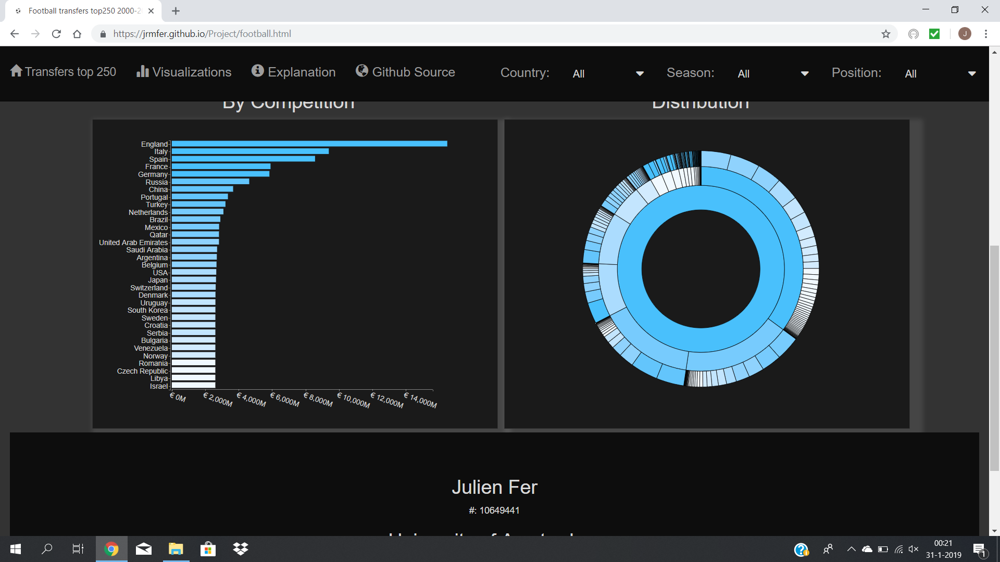
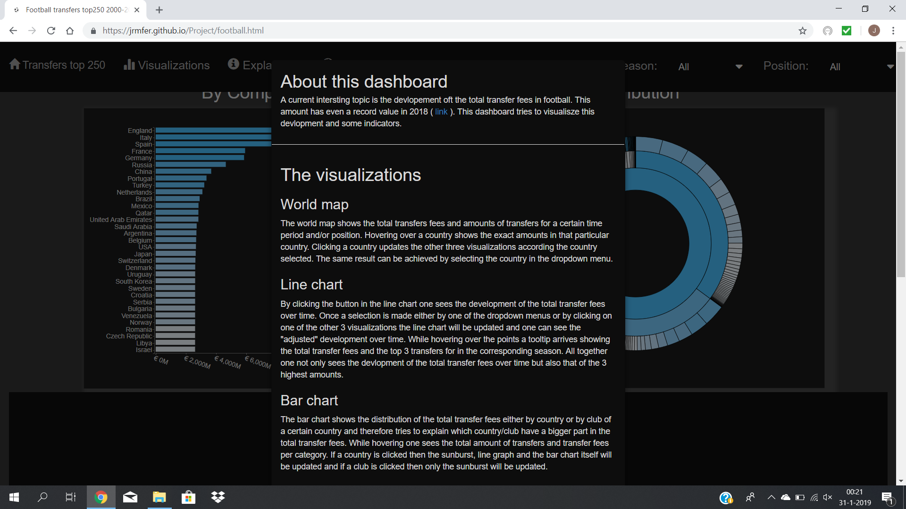

# Project Minor Programming (UvA)
* Name: Julien Fer
* Student Number: 10649441
* University: University of Amsterdam

This repository contains the functionality for a dashboard viusalization

## [GitHub Pages](https://jrmfer.github.io/Project)

## Problem Statement
A hot topic in sport news is the development of the transfer values in
football.
The last past years the values rised to high amounts and from clubs as
well associety complaints arises regarding this development. This project
tries toexplain this development based on the top 250 transfers from
2000-2018. Certainindicators will be examined as the competitions these
transfers took place, which club bought and the positions of the players.
Hopefully the statistics will show a pattern trough the years.

## Solution
A D3 dashboard that shows the development of the total transfer fees over
time which can be examined in more depth with some indicators as the
country, season and position.

Main features:

* Interactive world map (MVP)
  - Shows all countries with hover and click.

* Interactive horizontal bar chart (MVP)
  - Shows the total transfer fees per country/club with hover and click.

* Sunburst (MVP)
  - Shows the distribtuion of the total transfer fee with tooltip and click

* Navbar with dropdowns (MVP)
  - Navbar to switch to home page, visualization, explanation (modal) and Github

Extra features:

* line chart with animation
  - shows the development of the total transfer fee over time

Instead of a visual sketch a website walktrough will follow.

## Website Waltrough
#### Homepage
The website consists of a main homepage that shows the title and subtitle
of the product, projected on an image. At the top of the page is a
navigation bar, which contains links with symbols to the other webpages
of the site.

At the bottom of the page (when scrolled down) some general information is
displayed. Some of the text is hyperlinked.

#### Visualizations page
This page is the most interesting page of the website. It contains all
the data visualizations that have been made. At the top there is again a
navigation bar, with wich now a modal can be triggered by the explanation
nav-link and 3 dropdown menus with wich you can update the
visualizations.

At the left there is map of the world. The countries are color coded to
the amount of the total transfer fee in that country. A color that is
more blue has a higher value. The map holds a tooltip in which one can
see the exact total transfer fee and amount of transfers. When a country
is clicked the other 3 visualizations will be updated.

At the right there is a line chart which appear for the first time
animated and for every next update this animation can be triggered by
clicking the button in the chart. The line chart shows the development of
the total transfer fee over time for a given dataset. This exact amount
can be shown by the tooltip as well as the corresponding top 3 transfer
for that season. The dots contain a click function that updates the other
visualizations.

When scrolling down one will encounter more visualizations.
At the left there will be a horizontal bar chart which visualiszes the
total transfer fees per country/club. There is a tooltip which shows this
exact amount and the amount of transfers. When a bar is clicked all the
visualizations will be updated.

At the right there is a sunburst with in the middle a representation of
the world's total transfer fee. This sunburst visualizes the distribution
of the transfer fees among the world. All elements in a layer are color
codedbased on their percentage in perspective to its parent. The first
layer represents all the clubs in the dataset, the second the countries
and the third (inner) layer the world. A tooltip shows the exact total
transfer fee and its percentage w.r.t its parent.

Fogot what the dashboard is about? Select the explanation in the navbar
and a modal will appear.

And again at the bottom of the page (when scrolled down) some general
information is displayed. Some of the text is hyperlinked.

## Prerequisites
#### Data Source
All used data collected from [Kaggle](https://www.kaggle.com/), an
online community of data scientists and machine learners, owned by
Google, Inc. The exact data used is:
* [Top 250 transfers 2000-2018](https://www.kaggle.com/vardan95ghazaryan/top-250-football-transfers-from-2000-to-2018/version/1)

#### Code Sources
Note: a lot of these materials have their own respective licenses.
* Bootstrap related elements:
    - [Navigation bar](https://www.w3schools.com/bootstrap/bootstrap_navbar.asp)
    - [Jumbotron](https://www.w3schools.com/bootstrap/bootstrap_jumbotron_header.asp)
    - [Rows and columns](https://www.w3schools.com/bootstrap/bootstrap_grid_basic.asp)

* Style dropdown menus:
  - [Dropdown](https://byprimer.co/blog/style-select-fields-using-css/)

* Datamap:
  - [Topojson](https://bl.ocks.org/micahstubbs/raw/8e15870eb432a21f0bc4d3d527b2d14f/a45e8709648cafbbf01c78c76dfa53e31087e713/world_countries.json)

* Line chart (animation):
  - [Arctween](https://bl.ocks.org/mbostock/5649592)

* Sunburst
  - [Tutorial](https://bl.ocks.org/denjn5/e1cdbbe586ac31747b4a304f8f86efa)
  - [Transition](https://bl.ocks.org/maybelinot/5552606564ef37b5de7e47ed2b7dc099)
* Favicon
  - [Favicon](https://www.freefavicon.com/freefavicons/sports/iconinfo/football-soccer-ball-152-183228.html)
* Homepage image:
  - [Image](https://www.google.com/search?q=football+transfers&tbm=isch&tbs=simg:CAQSmQEJu8Ck-C_17Ig0ajQELEKjU2AQaBghCCBUICAwLELCMpwgaYgpgCAMSKM4fnxuoG8wf0h-fENQcmxCrEM0f3S6GL-Au8S3yLYIvkCX0Oosv3i4aMIWnxaXKfQaUt8wFOUz6-PSUVL8OEAgymNIWX91FcgYYYMTNlmWStBl4F8yMPhoNiCAEDAsQjq7-CBoKCggIARIE6IkN4Qw&sa=X&ved=0ahUKEwjZjfDQz5bgAhXMJVAKHSmvBt0Qwg4IKigA&biw=767&bih=744#imgrc=aqDT6u3kNehgRM:)

## External components

* [Pandas](https://pandas.pydata.org/pandas-docs/stable/)
* [D3.js](https://d3js.org)
* [jQuery](https://jquery.com)
* [Bootstrap](https://getbootstrap.com)
* [TopoJSON](https://github.com/topojson/topojson)
* [FontAwesome](https://fontawesome.com/)

<i>
This project is licensed under the terms of the MIT license. 
Julien Fer, 2018
</i>

