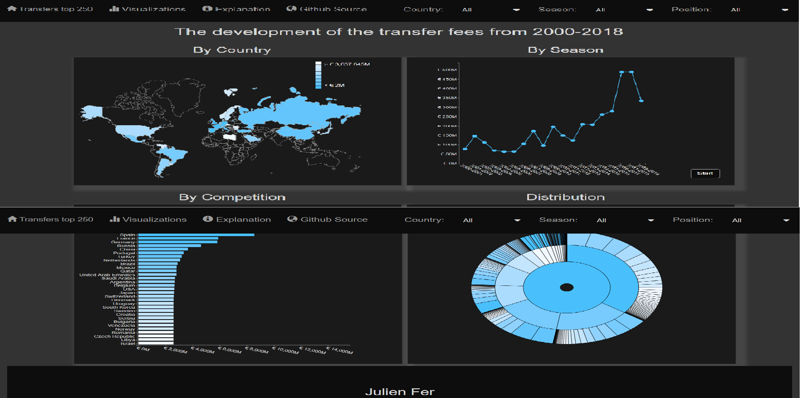

# Project Minor Programming (UvA)
* Name: Julien Fer
* Student Number: 10649441
* University: University of Amsterdam

## Problem Statement
A hot topic in sport news is the development of the transfer values in
football. The last past years the values rised to high amounts and from clubs as
well associety complaints arises regarding this development. This project
tries toexplain this development based on the top 250 transfers from
2000-2018. Certainindicators will be examined as the competitions these
transfers took place, which club bought and the positions of the players.
Hopefully the statistics will show a pattern trough the years.

#### Solution
A D3 dashboard that tries to show the development of the total transfer fees over
time which can be examined in more depth with some indicators as the
country, season and position.

## Technical Design
This section describes the functionality of the product, starting with a high
level overview and continuing on to more in depth technicalities like functions
and modules.

### High Level Overview
#### Dashboard Components
The visualization consists of the following components:

* Every html template contains a fixed navbar at the top with 4 navegational
links (all with glyphicons) and 3 interactive elements (dropdowns), a
footer at the bottom and a title with favicon symbol of a football.

* A homepage with image and on top of the image a text block (html template #1)

* Four D3 visualizations (html template #2):
All (interactive) visualizations are included with an on click function, colors
representing the values (except line chart) and a tooltip.
  - Datamap
  - Line chart (includes button to start animation of drawing line chart)
  - Horizontal bar chart
  - Sunburst

### Detailed Overview
#### Data
The data folder contains 3 different files:

* [Orignal Dataset](data/top250-00-19.csv)
  - this one is preproccesed in python
* [Preproccesed Dataset](data/transfers250.csv)
  - The competition names are replaced by their corresponding country names
  - Removed whitespace
The data will be imported by the d3.csv function (see [football.js](scripts/football.js))
and this returns an array with transfers. The transfers are repsented as an
object with all containing the necassary information.

* [Data Topojson](data/world_countries.json)
  - Contains all the paths to draw a datamap of the world.

#### HTML, Bootstrap and FontAwesome
The repository knows 2 HTML templates located in the root of the repository. The
pages, homepage ([index.html](index.html)) and the visualizations
([football.html](football.html)). All pages have the same title with favicon shown
in the website-tab of the browser and the elements of the page are placed in a
Bootstrap grid system.
 
The two templates are linked with each other through the Bootstrap navigation
bar. More on the left of the navigation bar there is an element to show a modal
(works only for the visualization page) and a link to the Github repository.
On the right there are 3 dropdown menus (only for football.html). In the HTML
template these are regular select elements and are styled in the CSS file
([football.css](stylesheets/football.css)). Furthermore the line chart contains a
button element from Bootstrap but styled with CSS.   At the bottom of the pages
there is a Bootstrap jumbotron containing some information which is also styled
with the CSS files in the repository.

#### Javascipts
Every visualization has its own Javscript file and are combined in
[football.js](scripts/football.js). In all scripts the svg is declared global
and in most of them elements as the axis, legend and scale are also declared
global.

* [datamap.js](scripts/datamap.js)  
This script receives the loaded Topojson and transfers data from football.js
and initiates a datamap with color.

  - Function to find the relevant dataset for the datamap (findValuesMap)  
    loop over array of transfers, returns object with an array for all the
    total transfer fee values for the color scale (quantile) and adds object of
    countries with the "correct" values.

  - Function for on click events (dataMapClick)  
    updates line chart, bar chart and sunburst. Also sets dropdown to new country
    (works only if country has data)

  - Function for tooltip text (mouseoverMap)  
    Shows the total transfer fee and amount if country in the relevant dataset,
    other undefined values

  - Function to add legend (addLegendMap)  
    Follows the colorscheme and only shows the border values of the quantiles
    (formatted)

  - Function to draw datamap (drawDataMap)  
    Combines above function to draw datamap with transition on the fill of the
    colours and add change of colour when hovering

* [linechart.js](scripts/linechart.js)  
This script contains the functionality to draw a line chart from the array
of transfers.

  - Function for button (animateLine)  
    gathers the condition for the dataset (dropdowns) and returns updateLine

  - Function for retrieving relevant dataset (updateLine)  
    finds total transfer fee per season, all the transfers per season (sorted)
    and the seasons (only returns if there is any data)

  - Function to draw line chart (drawLineChart)  
    transition on axis, dots and line  
    onclick on dots to update datamap, bar chart and sunburst  
    mouse on effects to show season, total transfer fee, top 3 transfers
    and dots changing colors (top 3 can also be top 1 or 2 thanks to
    an if-else if - else if statement)

* [barchart.js](scripts/barchart.js)  
This script contains the functionality to draw a sorted horizontal bar chart from
the array of transfers.

  - Function to gather the relevant dataset (updateBarChart)  
    gathers total transfer fee and amount of transfers either by country or by
    club in the selected country for the givens season and/or posiiton and
    returns drawBarChart

  - Function for axis bar chart with transition (axisBarchart)  
    adds new axis with transtition

  - Function to draw bar chart  
    draws bar chart with transition, onclick to update sunburst (zoomSunburst),
    hover with tooltip showing the data.

* [sunburst.js](scripts/sunburst.js)  
This script contains the functionality to draw a sunburst of depth 3 from
the array of transfers.

  - Function to preprocces data (preproccesSunburst)  
    gathers the relevant data and convert it into an hierarchical structure
    needed for the sunburst

  - Function for onclick events (clickSun)  
    updates bar chart and only change value dropdown if country is selected
    and add transition to sunburst.

  - Function to update zoomburst when dataset switches of country (zoomSunburst)

  - Function to draw Sunburst (drawSunburst)  
    combines the above functions to draw a sunburst, with tooltip showing total
    transfer fees and the percentage relative to its parent.

* [football.js](scripts/football.js)  
This script has a few functions to set the options for the dropdowns and thus an
update function for either one of them.

  - Function optionsDropdown  
    set options dropdowns

  - countriesDropdownChange, seasonsDropdownChange, positionsDropdownChange  
    triggers the update functions, with season or positions changes there is an
    extra check for data needed.

#### Stylsheets (CSS)
* [styles.css](stylesheets/styles.css)  
  Contains the stylesheet for the homepage: Navbar, dropdowns, text block and
  jumbotron

* [football.css](stylesheets/football.css)  
  Contains the stylesheet for the visualization:
  Navbar, dropdowns, body, svg, tooltips, axis button, modal etc..

## Procces and Development
#### Challenges
One of the big challanges was to work with Bootstrap as if never worked with it
before. Constructing a grid system and appending a svg to it was quite problematic
at the beginning, but was solved by using viewbox for the width and height measures
of the svg.  
I also encountered problems when I tried to add the options to Bootstrap's original
dropdown menu as I could not select the options with D3. This problem was solved
by adding a regular select to the navigation bar amd styling it in CSS. 
Now the dropdronw "problem" was solved a new problem arised as the dropdown was
bigger than the navigation bar. This was solved by changing the height of the
navigaition bar, centering the elements in the navigation bar and adding padding
to the body with help of CSS.
  
Another big challenge was the construciton of the sunburst as this was also new
to me. Especially the merge and transition was difficult, but was solved by
merging the slices of the new dataset before removing the slices of the old
dataset. When a country was already selected and one switches season/postition
I needed to first redraw the sunburst and then return zoomSunburst with the
country as argument.

#### Acquired Skills
* data formatting as I needed different dataset for the
  different type of visualizations in the dashboard.

* Learned working with CSS and how to turn off web appearances and create custom
  html elements.

* General improvement HTML, D3, CSS programming skills

## Comparison to DESIGN.md
#### Changes
* Layout now includes homepage and links on the navigation bar instead of only
  dropdowns and a footer bottom page.

* Data is gatherd as an array of transfers which in turn are represented as objects
  - This was a better structure as every transfer now contained all the information
    on which the data could easily be filtered.

* Did not make use of d3-tip.js
  - Widht and height of tootlip varies in the different charts, so decided to
    custom style a tooltip with d3 and CSS.

* Created sunburst instead of pie chart
  - Sunburst shows more in depth statistics.

* Indeed have an update function for every chart
  - As this maybe is the hardest part I chose to make different update functions
    as a mistake will be prevented.
